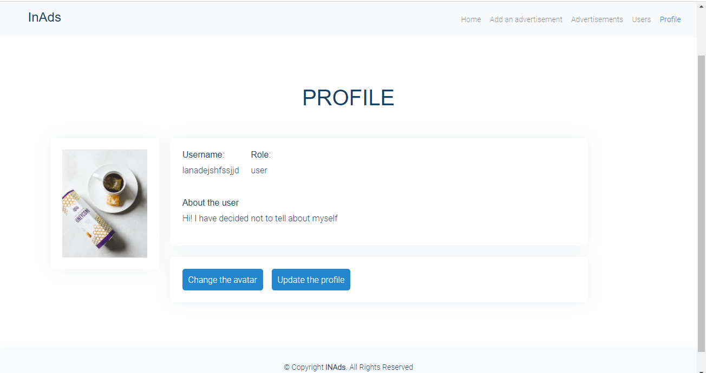

# Spring boot app
I have decided to develop an app, using spring boot

## Technologies
* Spring data
* Spring security
* Spring boot 
* Vue
* Vuex
* Vue Router

>
>
>

## How to run the app
In the terminal type the following:
* npm install
* npm run watch
In addition, you need to create the file, named 'db.properties' in the resources folder. Then create tables, matched with entities, located in folder `/src/main/java/com/example/webapp/models`. After that, run the spring boot app.